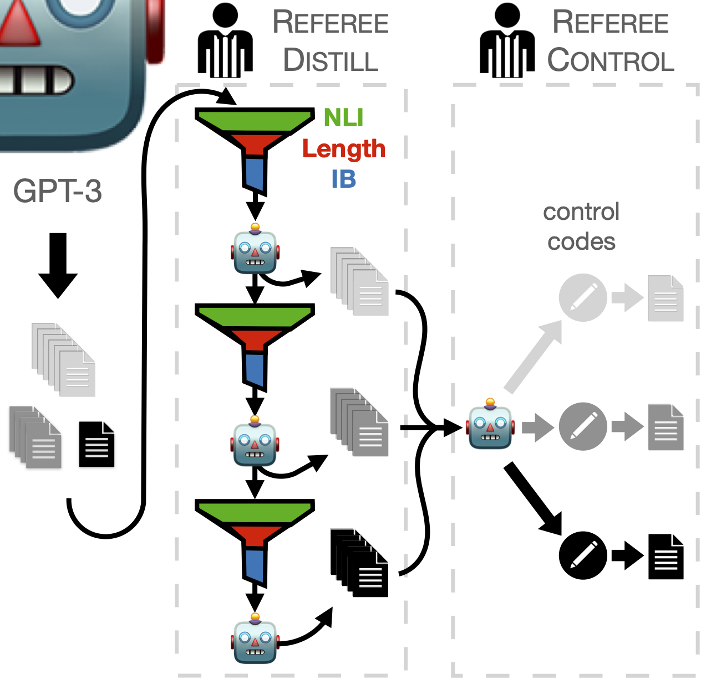

# [Refer]ence-fr[ee] sentence summarization



Please refer to the [manuscript](https://arxiv.org/abs/2210.13800) for a detailed description of the method and results.

## Models

We have released all models used in the manuscript, and highlighted the versions used in human evaluation.

Please don't hesitate in reaching out if you are attempting to use Referee as a baseline and face any issues in running these models!

### Referee-Distill: iteratively generating shorter summaries
|                                                                            | Hugginface API URL                                                                    |
|----------------------------------------------------------------------------|---------------------------------------------------------------------------------------|
| Referee-Distill Iteration 1                                                | [msclar/referee-distill_iter-1](https://huggingface.co/msclar/referee-distill_iter-1) |
| Referee-Distill Iteration 2                                                | [msclar/referee-distill_iter-2](https://huggingface.co/msclar/referee-distill_iter-2) |
| Referee-Distill Iteration 3 <br/>**(Checkpoint used in human evaluation)** | [msclar/referee-distill_iter-3](https://huggingface.co/msclar/referee-distill_iter-3) |

### Referee-Distill with context filter: iteratively generating shorter summaries (using Information Bottleneck filter)
|                                                   | Hugginface API URL                                                                                                            |
|---------------------------------------------------|-------------------------------------------------------------------------------------------------------------------------------|
| Referee-Distill (with context filter) Iteration 1 | [msclar/referee-distill-with-context-filter_iter-1](https://huggingface.co/msclar/referee-distill-with-context-filter_iter-1) |
| Referee-Distill (with context filter) Iteration 2 | [msclar/referee-distill-with-context-filter_iter-2](https://huggingface.co/msclar/referee-distill-with-context-filter_iter-2) |
| Referee-Distill (with context filter) Iteration 3 | [msclar/referee-distill-with-context-filter_iter-3](https://huggingface.co/msclar/referee-distill-with-context-filter_iter-3) |

### Referee-Control: simultaneously compressing at any given compression range
|                                                                            | Hugginface API URL                                                                    |
|----------------------------------------------------------------------------|---------------------------------------------------------------------------------------|
| Referee-Control Iteration 1                                                | [msclar/referee-control_iter-1](https://huggingface.co/msclar/referee-control_iter-1) |
| Referee-Control Iteration 2                                                | [msclar/referee-control_iter-2](https://huggingface.co/msclar/referee-control_iter-2) |
| Referee-Control Iteration 3 <br/>**(Checkpoint used in human evaluation)** | [msclar/referee-control_iter-3](https://huggingface.co/msclar/referee-control_iter-3) |
| Referee-Control Iteration 4                                                | [msclar/referee-control_iter-4](https://huggingface.co/msclar/referee-control_iter-4) |
| Referee-Control Iteration 5                                                | [msclar/referee-control_iter-5](https://huggingface.co/msclar/referee-control_iter-5) |
| Referee-Control Iteration 6                                                | [msclar/referee-control_iter-6](https://huggingface.co/msclar/referee-control_iter-6) |
| Referee-Control Iteration 6                                                | [msclar/referee-control_iter-7](https://huggingface.co/msclar/referee-control_iter-7) |


## Generated data

We released all the generated data from the models released above.

- The data released for Referee-Distill step `i` is exactly the data used in training Referee-Distill step `i+1`.
- The data released for Referee-Control step `i` is exactly the data used in training Referee-Control step `i+1`.

We are very thankful to OpenAI for the access to their API. Following the API usage guidelines, GPT-Instruct Curie generations are not released publicly.

*Warning:* all generated summaries are of RealNews sentences. Some RealNews articles may reflect biased or discriminatory views with which the authors do not agree.

## Code

**This section is only relevant if you are trying to train your own Referee model. Otherwise, please use the Huggingface API directly (see links above).**

```CODE INSTRUCTIONS TO BE UPDATED HERE!```

### Paper Citation

If you used this code for your experiments or found it helpful, consider citing the following paper:

```
@inproceedings{sclar2022reference,
    title = "{B}ottle{S}um: Unsupervised and Self-supervised Sentence Summarization using the Information Bottleneck Principle",
    author = "Sclar, Melanie  and
      West, Peter  and
      Kumar, Sachin  and
      Tsvetkov, Yulia  and
      Choi, Yejin",
    booktitle = "Proceedings of the 2022 Conference on Empirical Methods in Natural Language Processing",    month = nov,
    year = "2022",
    address = "Abu Dhabi, UAE",
    publisher = "Association for Computational Linguistics",
}
```